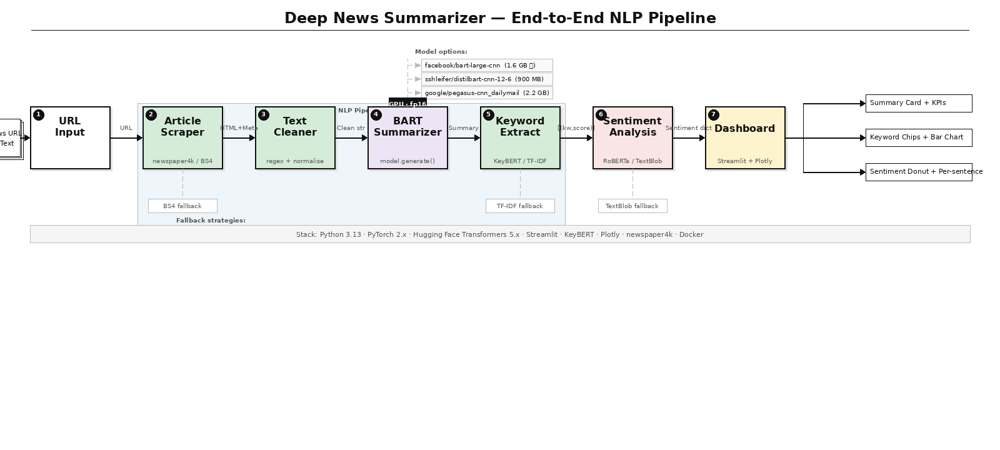

# 📰 Deep News Summarizer

> End-to-end NLP pipeline that takes any news article URL or pasted text and produces an abstractive summary, top keywords, and sentiment analysis — all in an interactive dashboard.



---

## ✨ Features

- 🤖 **Abstractive Summarization** — BART generates new sentences, not just extracts
- 🔑 **Semantic Keywords** — KeyBERT scores keyphrases by relevance using sentence embeddings
- 💬 **Sentiment Analysis** — RoBERTa scores every sentence individually (Positive / Neutral / Negative)
- 📊 **Interactive Dashboard** — Plotly charts, donut graphs, KPI metrics
- 🗞️ **Auto Scraper** — extracts title, author, publish date, top image from any news URL
- ⚡ **GPU Accelerated** — auto-detects CUDA, runs in fp16 for ~2s per article
- 🔄 **Auto Chunking** — handles articles of any length by splitting and merging
- 🐳 **Docker Ready** — runs on any system with one command

---

## 📊 Performance

| Model | Size | Avg Compression | GPU Speed | CPU Speed |
|---|---|---|---|---|
| `facebook/bart-large-cnn` | 1.6 GB | ~70% | ~2s | ~18s |
| `sshleifer/distilbart-cnn-12-6` | 900 MB | ~68% | ~1s | ~10s |
| `google/pegasus-cnn_dailymail` | 2.2 GB | ~72% | ~3s | ~25s |

---

## 🏗️ Pipeline

```
News URL / Pasted Text
        │
        ▼
┌───────────────┐
│    Scraper    │  newspaper4k → title, author, date, image, text
│  + BS4 fallbk │
└───────┬───────┘
        │
        ▼
┌───────────────┐
│ Text Cleaner  │  strip ads, normalize whitespace, fix quotes
└───────┬───────┘
        │
        ▼
┌───────────────┐
│     BART      │  model.generate() — no pipeline() — GPU fp16
│  Summarizer   │  auto-chunks long articles
└───────┬───────┘
        │
   ┌────┴────┐
   ▼         ▼
┌──────┐  ┌──────────┐
│KeyBERT│  │ RoBERTa  │
│  KW  │  │Sentiment │
└──────┘  └──────────┘
   │           │
   └─────┬─────┘
         ▼
┌─────────────────┐
│   Streamlit     │  Summary · Keywords · Sentiment · Timings · History
│   Dashboard     │
└─────────────────┘
```

---

## 🚀 Getting Started

Choose **one** of the three methods below.

---

### Method 1 — Run Locally (Python)

**Requirements:** Python 3.10+, Git

#### Step 1 — Clone the repo

```bash
git clone https://github.com/YOUR_USERNAME/news-summarizer.git
cd news-summarizer
```

#### Step 2 — Create a virtual environment

```bash
# Windows
python -m venv venv
venv\Scripts\activate

# Mac / Linux
python3 -m venv venv
source venv/bin/activate
```

You should see `(venv)` at the start of your terminal prompt.

#### Step 3 — Install PyTorch

**Windows / Linux with NVIDIA GPU (recommended):**

First check your CUDA version:
```bash
nvidia-smi
```
Look for `CUDA Version: XX.X` in the top-right corner.

```bash
# CUDA 12.1 (most common)
pip install torch torchvision torchaudio --index-url https://download.pytorch.org/whl/cu121

# CUDA 11.8
pip install torch torchvision torchaudio --index-url https://download.pytorch.org/whl/cu118
```

**Mac or CPU-only:**
```bash
pip install torch torchvision torchaudio
```

Verify:
```bash
python -c "import torch; print('GPU:', torch.cuda.is_available())"
```

#### Step 4 — Install dependencies

```bash
pip install --only-binary=:all: transformers accelerate sentencepiece protobuf
pip install newspaper4k beautifulsoup4 requests lxml
pip install keybert sentence-transformers textblob plotly streamlit
```

One-time language data download for TextBlob:
```bash
python -m textblob.download_corpora
```

#### Step 5 — Run

```bash
streamlit run app.py
```

Open **http://localhost:8501** in your browser.

> ⏳ **First run:** downloads ~2.5 GB of models (BART + RoBERTa + MiniLM). Cached permanently after that — next runs start in seconds.

---

### Method 2 — Docker (No Python needed)

**Requirements:** [Docker Desktop](https://www.docker.com/products/docker-desktop)

#### Step 1 — Clone the repo

```bash
git clone https://github.com/YOUR_USERNAME/news-summarizer.git
cd news-summarizer
```

#### Step 2 — Build the image

```bash
docker build -t news-summarizer .
```

> ⏳ First build takes ~5–10 min (downloads Python, dependencies, and DistilBART model).

#### Step 3 — Run

```bash
# CPU
docker run -p 8501:8501 news-summarizer

# With NVIDIA GPU
docker run --gpus all -p 8501:8501 news-summarizer
```

Open **http://localhost:8501** in your browser.

#### Stop the container

```bash
docker ps                          # find container ID
docker stop <container_id>
```

---

### Method 3 — Streamlit Cloud (No install, runs in browser)

1. Go to **https://share.streamlit.io**
2. Sign in with GitHub
3. Click **New app**
4. Select: Repository → `YOUR_USERNAME/news-summarizer` · Branch → `main` · File → `app.py`
5. Click **Deploy**

You get a public URL like:
```
https://yourname-news-summarizer-xxxx.streamlit.app
```

> ⚠️ Streamlit Cloud is **CPU only**. Switch to **DistilBART** in the sidebar for faster inference (~10s per article).

---

## 📁 Project Structure

```
news-summarizer/
├── app.py                  # Streamlit dashboard + pipeline orchestrator
├── scraper.py              # Stage 2: URL scraping & text cleaning
├── summarizer.py           # Stage 3: BART direct inference (model.generate)
├── keywords.py             # Stage 4: KeyBERT / TF-IDF keyword extraction
├── sentiment.py            # Stage 5: RoBERTa sentiment analysis
├── requirements.txt        # Python dependencies
├── Dockerfile              # Container definition
├── .dockerignore
├── pipeline_final.png      # Architecture diagram
├── .streamlit/
│   └── config.toml         # Dark theme
└── README.md
```

---

## ⚙️ Sidebar Controls

| Setting | What it does |
|---|---|
| **Model** | Switch between BART-large, DistilBART, PEGASUS |
| **Max tokens** | Maximum length of generated summary |
| **Min tokens** | Prevents summary from being too short |
| **Beam width** | Higher = better quality, slower (4 is default) |
| **Length penalty** | >1 favours longer summaries, <1 shorter |
| **No-repeat n-gram** | Prevents repetitive phrases in summary |
| **Keywords** | Number of keyphrases to extract (5–20) |
| **KeyBERT toggle** | Semantic extraction vs fast TF-IDF fallback |

---

## 🔧 Tech Stack

| Component | Library |
|---|---|
| Web framework | Streamlit >= 1.35 |
| Summarization | Hugging Face Transformers 5.x (BART / PEGASUS) |
| Deep learning | PyTorch 2.x |
| Scraping | newspaper4k, BeautifulSoup4 |
| Keywords | KeyBERT + sentence-transformers |
| Sentiment | cardiffnlp/twitter-roberta-base-sentiment |
| Charts | Plotly |
| Containerisation | Docker |

---

## 🐛 Common Issues

| Error | Fix |
|---|---|
| `ModuleNotFoundError: plotly` | `pip install plotly` |
| `Neither newspaper4k nor beautifulsoup4 installed` | `pip install newspaper4k beautifulsoup4` |
| `Unknown task summarization` | You have the old `app.py` — re-clone or replace it |
| Scraper error on a URL | Use the **✍️ Paste text** toggle instead |
| Out of GPU memory | Switch to DistilBART or set beam width to 1–2 |

---

## ☁️ Deploy Your Own

```bash
# Push to GitHub
git init
git add .
git commit -m "initial commit"
git remote add origin https://github.com/YOUR_USERNAME/news-summarizer.git
git branch -M main
git push -u origin main
```

Then deploy on Streamlit Cloud (free) or any cloud VM with Docker.

---

## 📜 License

MIT — free to use, modify, and deploy.

---

*Inspired by [hengluchang/deep-news-summarization](https://github.com/hengluchang/deep-news-summarization) — rebuilt with modern 2025 stack.*
